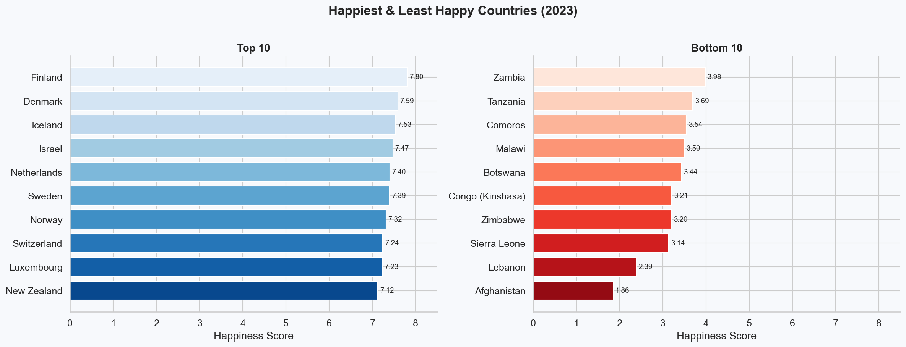
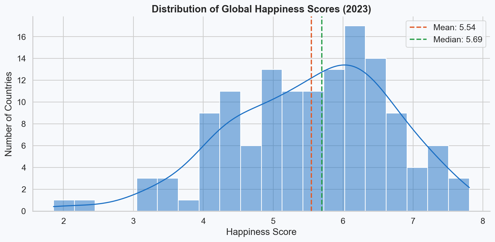
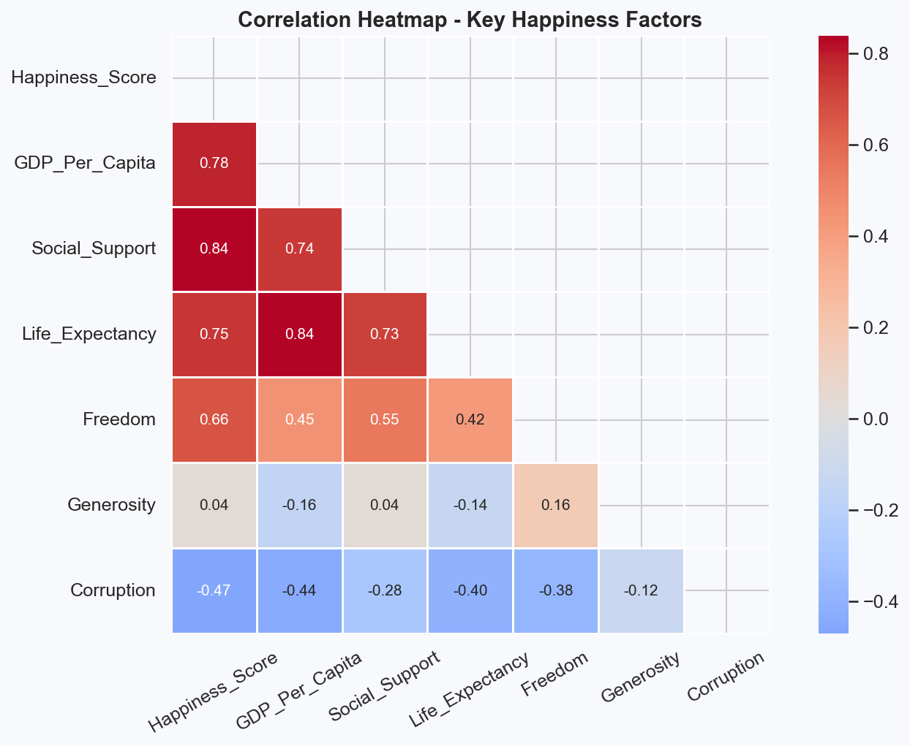
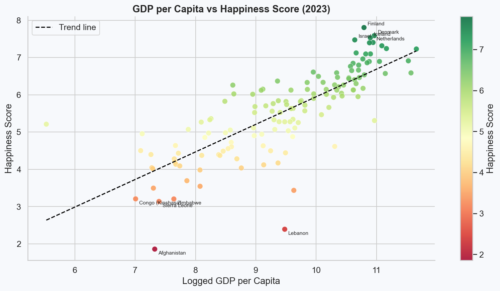
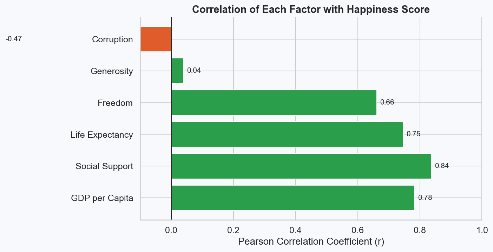
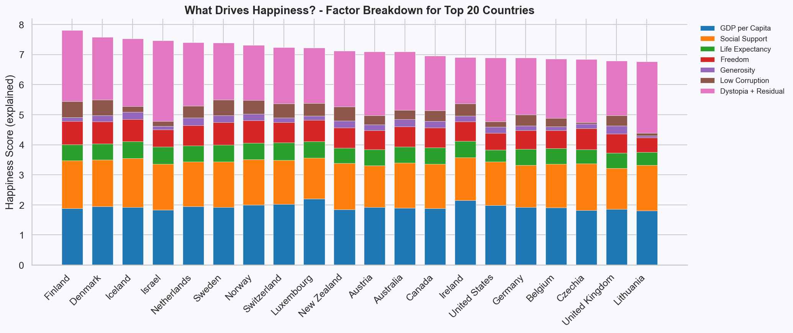

# World Happiness Project

This project is a full exploratory data analysis of the World Happiness Report 2023, which has been built entirely in Python. It covers data cleaning, statistical analysis and six visualisations to uncover what drives happiness across 137 countries.

## Tech Stack


## Project Overview

The World Happiness Report ranks countries by how happy their citizens perceive themselves to be, drawing on six key factors: GDP per capita, social support, life expectancy, freedom, generosity, and perceptions of corruption.

This project answers the following questions:

- Which countries are the happiest and least happy in 2023?
- How are happiness scores distributed globally?
- Which factors correlate most strongly with happiness?
- Does wealth alone explain happiness?
- What combination of factors drives the top-ranked nations?


## Visualisations

### Plot 1: Happiest & Least Happy Countries


A side-by-side horizontal bar chart comparing the 10 happiest and 10 least happy countries. Finland leads the ranking while Afghanistan sits at the bottom, with a score gap of over 5 points between them.

---

### Plot 2: Distribution of Global Happiness Scores


A histogram with a KDE curve showing how happiness scores are spread across all countries. The mean and median lines reveal a slight left skew, indicating a larger cluster of lower-scoring nations pulling the average down.

---

### Plot 3: Correlation Heatmap


A lower-triangle heatmap showing how each factor correlates with happiness and with each other. GDP per capita and social support emerge as the strongest predictors, while generosity shows the weakest relationship.

---

### Plot 4: GDP per Capita vs Happiness Score


A scatter plot of all 137 countries, coloured by happiness score on a red-to-green scale, with a trend line overlaid. The top 5 and bottom 5 countries are labelled directly on the chart. The strong upward trend confirms that wealthier nations consistently score higher.

---

### Plot 5: Factor Correlations with Happiness


A horizontal bar chart ranking each of the six factors by their Pearson correlation with happiness score. Green bars indicate a positive relationship; red indicates negative. This chart makes it immediately clear which levers matter most.

---

### Plot 6: What Drives Happiness? Factor Breakdown (Top 20)


A stacked bar chart breaking down exactly how much each factor contributes to the happiness score of the top 20 countries. GDP and social support dominate across the board, while generosity and low corruption play a smaller but consistent role.


## Key Findings

- **Finland** is the world's happiest country (7.80), **Afghanistan** the least happy (1.86)
- The global mean happiness score is approximately **5.54**, with a total range of **5.94 points**
- **GDP per capita** is the single strongest predictor of happiness (r ≈ 0.78)
- **Social support** is closely behind (r ≈ 0.77), reinforcing that community matters as much as wealth
- **Generosity** shows the weakest correlation with happiness (r ≈ 0.07)
- Wealth and community together account for the largest share of explained happiness in every top-ranked country


## Tools & Libraries

| Tool | Purpose |
|---|---|
| Python 3 | Core language |
| pandas | Data loading, cleaning, manipulation |
| matplotlib | Plot rendering and saving |
| seaborn | Statistical visualisation styling |
| numpy | Numerical operations and trend line fitting |


## How to Use

**1. Clone the repository**
```bash
git clone https://github.com/KxcperM/World-Happiness-Project.git
cd World-Happiness-Project
```

**2. Install dependencies**
```bash
pip install pandas matplotlib seaborn numpy
```

**3. Download the dataset**

Download `WHR2023.csv` from Kaggle:
[World Happiness Report 2023](https://www.kaggle.com/datasets/ajaypalsinghlo/world-happiness-report-2023)

Place the file in the same folder as `WorldHappiness.py`.

**4. Run the script**
```bash
python WorldHappiness.py
```

All 6 plots will be saved as PNG files automatically in the same folder.


## Dataset

- **Dataset:** World Happiness Report 2023
- **Source:** [Kaggle](https://www.kaggle.com/datasets/ajaypalsinghlo/world-happiness-report-2023)
- **Original report:** [World Happiness Report](https://worldhappiness.report/)
- **Countries covered:** 137

